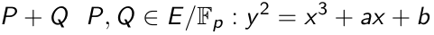

# q_elliptic_padd(p,a,b,P,Q)
## 定义
素数域上椭圆曲线点加运算

## 参数
int **p** **a** **b**:椭圆曲线参数

vector **P** **Q**：椭圆曲线上的不同点
## 返回值
P+Q的坐标（x，y）的量子态

# C_ecdlp(p, a, b, P, Q)
## 定义
经典计算机下椭圆曲线离散对数求解算法
## 参数
int **p** **a** **b**:椭圆曲线参数

vector **P** **Q**：椭圆曲线上的不同点
## 返回值
P与Q的倍数

# C_Epadd(a, b, p, P, Q)
## 定义
经典计算机下椭圆曲线仿射坐标系下加法运算
## 参数
int **p** **a** **b**:椭圆曲线参数

vector **P** **Q**：椭圆曲线上的不同点
## 返回值
椭圆曲线仿射坐标系下加法结果

# Ct_PointADD(vx1,vy1,x2,y2,p,n2,ctrl)
## 定义
量子虚拟机下的椭圆曲线控制点加运算
## 参数
int **p** **x2** **y2**:椭圆曲线参数

qlist **vx1** **vy1**:n2量子比特数组

int **n2**:ceil(log(p, 2))+1

vector **P** **Q**：椭圆曲线上的不同点

qubit **ctrl**：控制辅助量子比特
## 返回值
量子虚拟机下椭圆曲线控制点加运算模拟值

# q_elliptic_pdou(p, a, b, P)
## 定义
量子虚拟机下的椭圆曲线完成二倍点运算
## 参数
int **p** **a** **b**:椭圆曲线参数

**P**：椭圆曲线上的一个点

## 返回值
量子虚拟机下椭圆曲线二倍点运算模拟值

# Q_EpADD(vx1,vy1,x2,y2,p,n2)
## 定义
量子虚拟机下的椭圆曲线受控点加运算
## 参数
int **p** **x2** **y2**:椭圆曲线参数

qlist **vx1** **vy1**:n2量子比特数组

int **n2**:ceil(log(p, 2))+1
## 返回值
量子虚拟机下椭圆曲线受控点加运算模拟值

# Q_EpDOU(vx1,vy1,a,b,x,y,p,n2)
## 定义
量子虚拟机下模拟椭圆曲线二倍点运算
## 参数
int **p** **a** **b**:椭圆曲线参数

int **x** **y**:椭圆曲线上一个点的坐标

qlist **vx1** **vy1**:n2量子比特数组

int **n2**:ceil(log(p, 2))+1
## 返回值
量子虚拟机下椭圆曲线二倍点运算模拟值

# qinverse(q,p)
## 定义
量子虚拟机下模p求逆运算
## 参数
int **p**:模数

int **q**：操作数
## 返回值
量子虚拟机下模p求逆运算模拟值

# shor_ecdlp(p, a, b, P, Q)
## 定义
量子虚拟机下shor算法求解椭圆曲线离散对数运算
## 参数
int **p** **a** **b**:椭圆曲线参数
vector **P** **Q**：椭圆曲线上的不同点
## 返回值
P与Q的倍数
# shor_ecdlp7(p, a, b, P, Q)
## 定义
p=7情形下Shor算法计算ECDLP的函数
## 参数
int **p** **a** **b**:椭圆曲线参数
vector **P** **Q**：椭圆曲线上的不同点
## 返回值
P与Q的倍数
